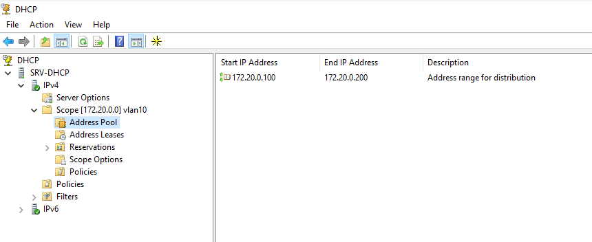
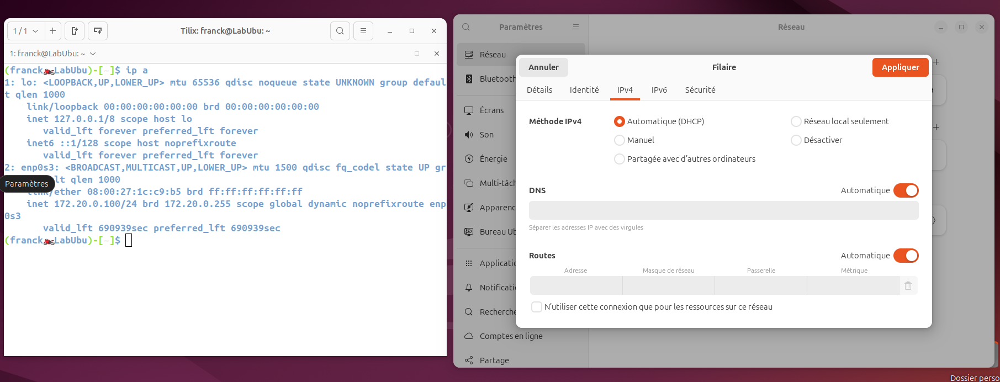
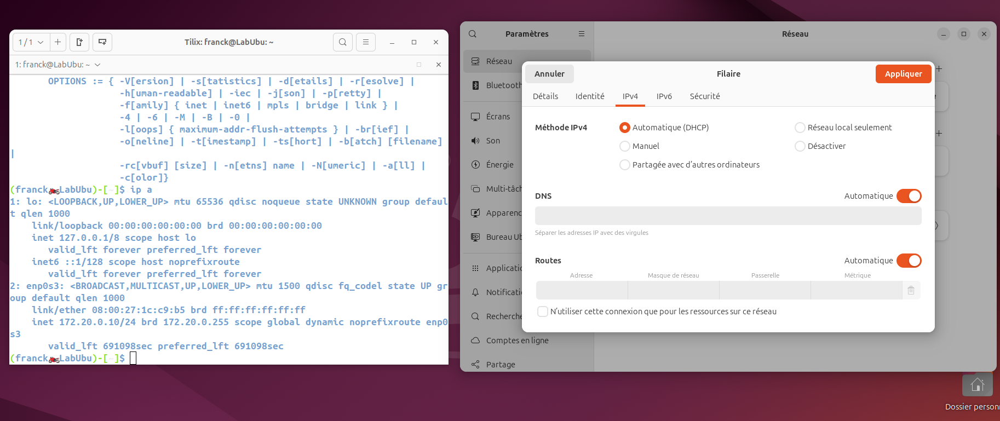
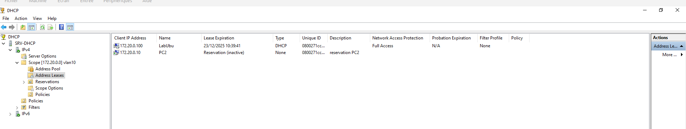

# Atelier_DHCP

## 1. Configuration du serveur DHCP :

Avec son adresse ip fixe 172.20.0.1/24
Son nom SRV-DHCP
Avec son Etendue IP

## 2. Configuration IP du PC1

## 3. Configuration IP du PC2

## 4. Fenêtre de réservation sur serveur 

